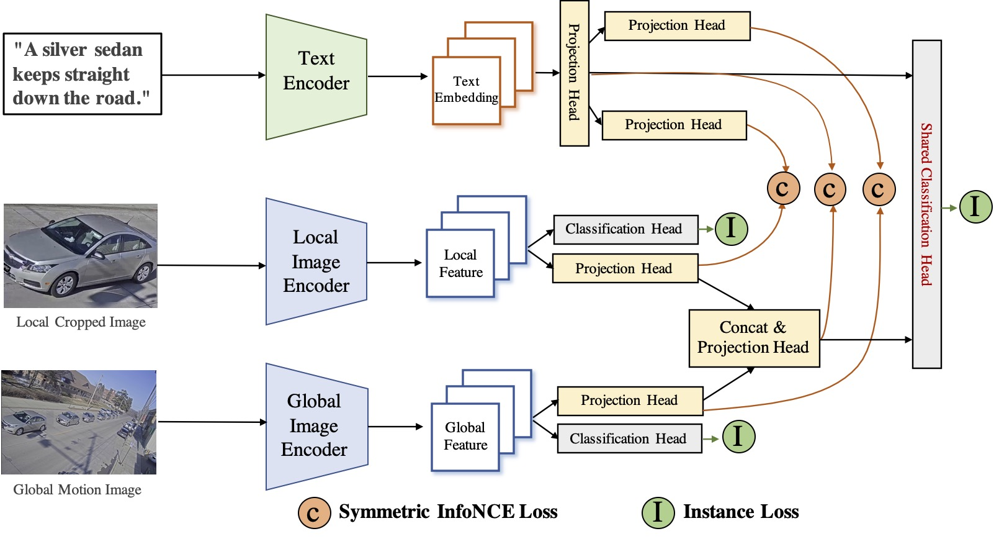

# AI City 2021: Connecting Language and Vision for Natural Language-Based Vehicle Retrieval
🏆 The 1st Place Submission to AICity Challenge 2021 Natural Language-Based Vehicle Retrieval Track (Alibaba-UTS submission)



We have two codebases. For the final submission, we conduct the feature ensemble, where features are from two codebases.

Part One is at here: https://github.com/ShuaiBai623/AIC2021-T5-CLV

Part Two is at here: https://github.com/layumi/NLP-AICity2021

## Prepare
-  Preprocess the dataset to prepare `frames, motion maps, NLP augmentation`

` scripts/extract_vdo_frms.py` is a Python script that is used to extract frames.

` scripts/get_motion_maps.py` is a Python script that is used to get motion maps.

` scripts/deal_nlpaug.py` is a Python script that is used for NLP augmentation.

- Download the pretrained models of Part One to  `checkpoints`. The checkpoints can be found [here](https://drive.google.com/drive/folders/1LAtP_CkNsM9ZDHlcr2PVmrR6f7YI-AQK?usp=sharing). The best score of a single model on TestA is 0.1927 from `motion_effb3_NOCLS_nlpaug_320.pth`.

The directory structures in `data` and `checkpoints` are as follows：
```
.
├── checkpoints
│   ├── motion_effb2_1CLS_nlpaug_288.pth
│   ├── motion_effb3_NOCLS_nlpaug_320.pth
│   ├── motion_SE_3CLS_nonlpaug_288.pth
│   ├── motion_SE_NOCLS_nlpaug_288.pth
│   └── motion_SE_NOCLS_nonlpaug_288.pth
└── data
    ├── AIC21_Track5_NL_Retrieval
    │   ├── train
    │   └── validation
    ├── motion_map 
    ├── test-queries.json
    ├── test-queries_nlpaug.json    ## NLP augmentation (Refer to scripts/deal_nlpaug.py)
    ├── test-tracks.json
    ├── train.json
    ├── train_nlpaug.json
    ├── train-tracks.json
    ├── train-tracks_nlpaug.json    ## NLP augmentation (Refer to scripts/deal_nlpaug.py)
    ├── val.json
    └── val_nlpaug.json             ## NLP augmentation (Refer to scripts/deal_nlpaug.py)

```


## Part One

- Modify the data paths in `config.py`


### Train
The configuration files are in `configs`.

```
CUDA_VISIBLE_DEVICES=0,1,2,3 python -u main.py --name your_experiment_name --config your_config_file |tee log
```

### Test

Change the `RESTORE_FROM` in your configuration file.

```
python -u test.py --config your_config_file
```
Extract the visual and text embeddings. The extracted embeddings can be found [here](https://drive.google.com/drive/folders/1DBVapSsw2glnJi_LxiRaIQXu3CWDfZbe?usp=sharing).
```
python -u test.py --config configs/motion_effb2_1CLS_nlpaug_288.yaml
python -u test.py --config configs/motion_SE_NOCLS_nlpaug_288.yaml
python -u test.py --config configs/motion_effb2_1CLS_nlpaug_288.yaml
python -u test.py --config configs/motion_SE_3CLS_nonlpaug_288.yaml
python -u test.py --config configs/motion_SE_NOCLS_nonlpaug_288.yaml
```

## Part Two

[Link](https://github.com/layumi/NLP-AICity2021)

## Submission

During the inference, we average all the frame features of the target in each track as track features, the embeddings of text descriptions are also averaged as the query features. The cosine distance is used for ranking as the final result. 

- Reproduce the best submission. ALL extracted embeddings are in the folder `output`:

```
python scripts/get_submit.py

```

## Friend Links：
- https://github.com/layumi/Vehicle_reID-Collection 
- https://github.com/layumi/NLP-AICity2021 
